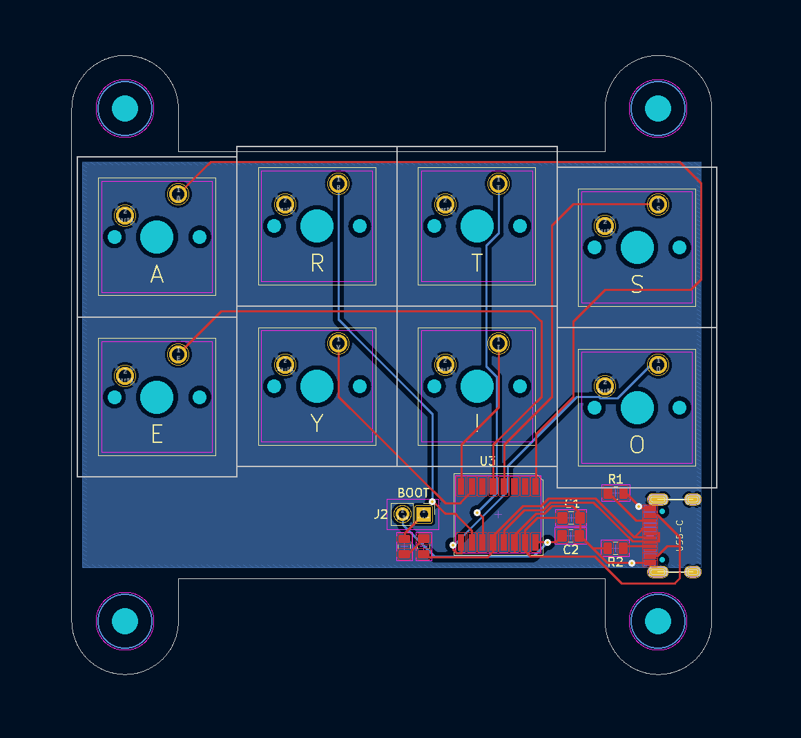

# artseyio
Hardware for an [ARTSEYIO layout](https://artsey.io/) single hand keyboard. The controller is a [CH552G](https://raw.githubusercontent.com/WeActStudio/WeActStudio.CH552CoreBoard/master/Datasheet/CH552DS1_en.PDF) and connects via USB-C.

The firmware requires [SDCC](https://sdcc.sourceforge.net/) and is based on an [excellent project by Wagiminator](https://github.com/wagiminator/CH552-USB-Knob).

The v1.1 layout.

A completed v1.0 board.

### Flashing
To compile the software, install sdcc and python3 and pyusb with pip, following the instructions from the [Wagiminator repo.](https://github.com/wagiminator/CH552-USB-Knob)

To flash, power up the board while shorting the BOOT jumper with tweezers or a piece of solder. Release the short once the device is plugged in, it should be in boot mode. Run `make flash` in the artseyio-firmware directory, and the board should be programmed.