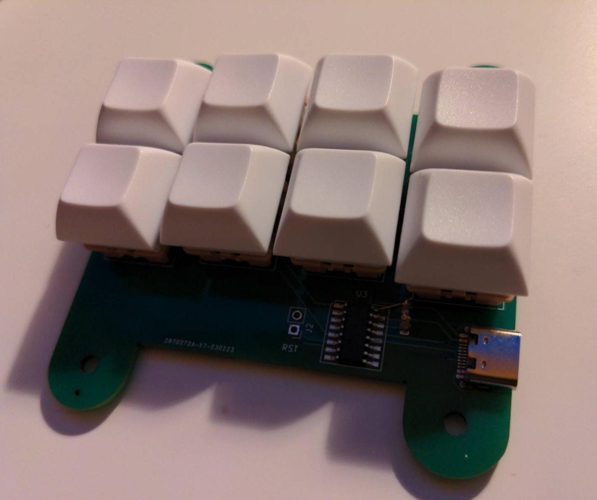

# artseyio
Hardware for an [ARTSEYIO layout](https://artsey.io/) single hand keyboard. The controller is a [CH552G](https://raw.githubusercontent.com/WeActStudio/WeActStudio.CH552CoreBoard/master/Datasheet/CH552DS1_en.PDF) and connects via USB-C.

The firmware requires [SDCC](https://sdcc.sourceforge.net/) and is based on an [excellent project by Wagiminator](https://github.com/wagiminator/CH552-USB-Knob).

